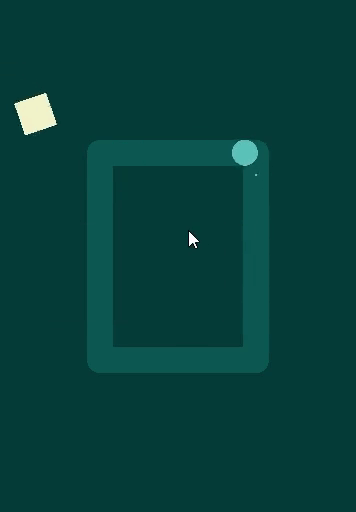
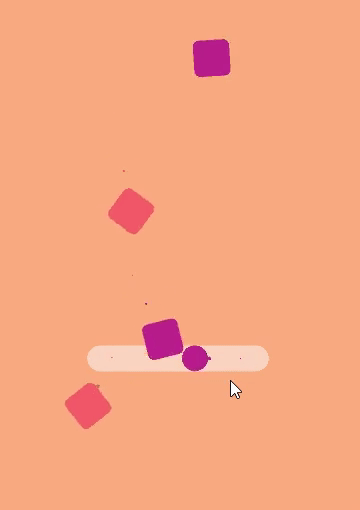

## Simple hyper casual 2d game
____

This repository will give the opportunity to create games similar to [this](https://www.pinterest.ru/johnwllm/_created/).
In Scenes folder you can check examples of games:

| Sample game 1 | Sample game 2  |
|:----:|:----:|
|  |  |

### How to use?
First you need to create a player object. 
Add component `PlayerController` on this object and assign Player transform to script. Set "Player" tag to this object.

Now you need to choose how the player will move, just **drag and drop script on player**. You can choose: 
+ Movement by checkpoints with a change of direction by tapping on the screen: `PlayerMovementWithCheckpointsDirection`
+ Movement by checkpoints with slowdown as long as you keep your finger on the screen: `PlayerMovementWithCheckpointsSlowdown`

Now you need to create enemies from which the player will need to dodge.
Create GameObject with name "EnemySpawner" or any other name. Assign `SpawnController` to this object. You need assign **delay** (in seconds), **prefab**, **Spawner** and **End point**, the point where the enemies will move. 

To the enemy prefab you need to add the **EnemyCollisionWithPlayer** script so that the player can die from the enemy and add tag "Enemy"".

You can choose one of the following spawners:
+ Spawn objects around one checkpoint `SpawnerAroundObject`
+ Spawn objects randomly beyond two points `SpawnerBeyoundTwoPoints`
+ Spawn object randomly on checkpoints `SpawnerOnCheckpoints`

And you need end point for enemy. Just drag and drop script on SpawnController object:
+ Just end point `EndPoint`
+ End point beyond two points `EndPointBeyondTwoPoints`

**Now you can start game.**

### How to add score?
1. Just create object and add `ScoreManager`.
2. Repeat all actions when creating a spawner for the enemy, but create a coin instead of the enemy.
3. To show points to the player you can use `ScoreToText`, but i would suggest you write your own script for this.
